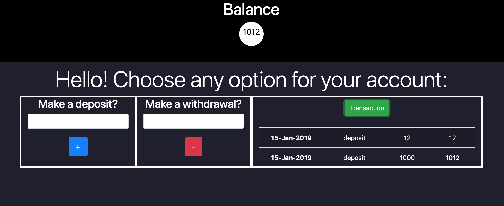

# Bank Tech

Week #10 on makers, A bit interactive program that allows you have to have an temporal account
and be able to make deposit and withdrawal and also see the current transaction.

## Requirements
- Hvae installed npm
- Have installed Eslint

## Getting Started
```
Just clone the repo and open index.html(Not for the moment, after I'll make it work)
For test open SpecRunner.html and then interacte with the app from the cosole.
```
## Run test

- Run eslint src (Linter)
- Open SpecRunner (Tester)

## Built With

* [Boostrap](https://getbootstrap.com) - UI.
* [JasminFramework](https://jasmine.github.io) - Framwork testing.
* [Jquery](https://jquery.com/upgrade-guide/3.0/) - Interaction.
* [ESlint](https://eslint.org) - Linter


