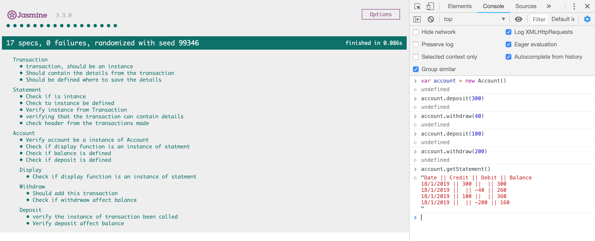

# Bank Tech

Week #10 on makers, A bit interactive program that allows you have to have an temporal account
and be able to make deposit and withdrawal and also see the current transaction.

## Requirements
#From the console:
- Have installed npm / if's not just run ``brew install node``)
- Check the version installed (node -v & npm -v)
- Have installed Eslint (If you don't have it, just run ```npm install -g eslint```)

## Getting Started
```
Just clone the repo and open SpecRunner.html and then interacte 
with the app from the cosole, as the next image:
```

## Run test

- Run eslint src/ from the console (Linter)
- Open SpecRunner (Tester)

## Built With

* [Boostrap](https://getbootstrap.com) - UI.
* [JasminFramework](https://jasmine.github.io) - Framwork testing.
* [Jquery](https://jquery.com/upgrade-guide/3.0/) - Interaction.
* [ESlint](https://eslint.org) - Linter

